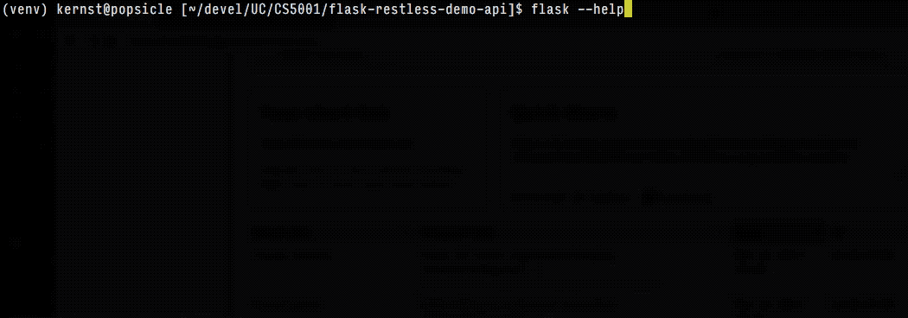

# Example Flask + Flask-Restless API

## Requirements

* Python 3.x (although 2.7.x + pip + virtualenv will probably still work)
* an internet connection to install the necessary Python libraries

## Installation

Instructions below assume a Bourne-like shell, like Bash, with the necessary
changes for Windows' Command Prompt noted. Make the appropriate changes if you
use some other shell.

1. Clone (or download) this repository and generate a fresh virtual
   environment:

    ```
    # clone this repository
    git clone https://github.com/ernstki/flask-restless-demo-api.git

    # change into the repository's base directory
    cd flask-restless-demo-api

    # create a virtual environment, into which you'll install all the
    # dependencies for this project; Python 2.x, use 'virtualenv' instead
    python3 -m venv venv

    # activate the virtual environment--modifies PATH variable for you
    # (in Windows Command Prompt, do 'venv\scripts\activate.cmd', I think)
    source venv/bin/activate
    ```

    If you install [autoenv] on a Unix system (OS X / macOS is Unix), you don't
    have to activate the virtualenv; it's done for you automatically when you
    enter the directory.

2. Install necessary Python packages using `pip`:

    ```
    pip install -r requirements.txt
    ```

3. Tell Flask where to find the app, initialize the `organism` database, and
   launch the Flask web application:

    ```
    # for Windows Command Prompt, do 'set FLASK_APP=demoapi\demoapi.py'
    export FLASK_APP=demoapi/demoapi.py
    export FLASK_DEBUG=1  # for template auto-reloading
    flask initdb
    flask run             # defaults to http://127.0.0.1:5000
    ```

    If you install [autoenv] on a Unix system (that includes macOS), you don't
    have to set `FLASK_APP` or `FLASK_DEBUG`; that's done for you automatically
    when you enter the directory.

    If you're running the Flask application within a VirtualBox VM, you'll want
    to be sure that the app runs on 0.0.0.0, so that the VirtualBox port
    forwarding works correctly. You can launch the app with command line flags
    to achieve that:

    ```
    flask run --host=0.0.0.0  # optionally: --port=5000
    ```

## Command line interface

Several `flask` subcommands for operating on the database are included,
courtesy of the [Click][] library, also by the author of Flask.

They're all documented with `flask --help` (or `flask <command> --help`), and
hopefully adequately commented in the source code so you could also add your
own.



For detailed information about argument parsing with Click, see
[the "Options" section][clickopts] of the official docs.

## Other tips

### Testing the API with [Postman][]

You can use [Postman][] to test requests to the API. The included
`postman_collection.json` may be imported through the Postman user interface,
and includes two example queries.

### Using MySQL instead of SQLite

Out of the box, this Flask app is set up to use a SQLite3 database in the
named `organism.db` in the same directory as the Flask app, but with slight
modifications, you can use a MySQL database instead. (Check out the comments
in `config.py`.)

The two `.sql` files are provided so that you can feed them into either
`mysql` or `sqlite3` at the command line to create the table schema and insert
the default values. Here's a sample invocation for SQLite:

```
sqlite3 organism.db < organism_table_sqlite3.sql
```

## Credits

Based on the Flask-Restless Quickstart and distributed under the same terms
([BSD 3-clause license](LICENSE.txt)).

Incorporates [Glyphicons][] and [Bootstrap][] CSS / JS source files, both under the
terms of the MIT license ([ref1][glyphlicense], [ref2][bslicense]).

Employs the [Select2][] JavaScript library for the auto-completing multi-select
control, also under MIT.

Thanks to Andrey Lando for helping jog my brain about some SQL query stuff that
one time. Credit to Tchibo [Black 'N White][tchibo] for supporting the initial
iteration of this project, caffeine-wise.

[autoenv]: https://github.com/kennethreitz/autoenv
[click]: http://click.pocoo.org/
[clickopts]: http://click.pocoo.org/5/options/
[postman]: https://www.getpostman.com/apps
[glyphicons]: https://glyphicons.com/
[bootstrap]: https://getbootstrap.com/
[glyphlicense]: https://glyphicons.com/license/
[bslicense]: https://github.com/twbs/bootstrap/blob/master/LICENSE
[select2]: https://select2.github.io/
[tchibo]: http://www.tchiboblackandwhite.ro/
